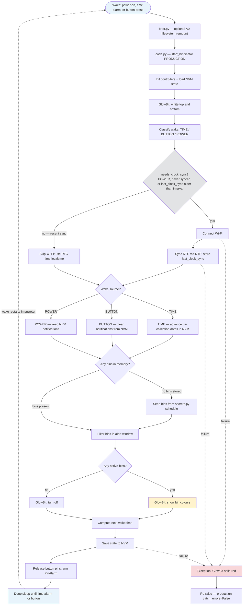

# PyBindicator — Agent Instructions

Firmware for a **Bindicator** — a 3D-printed wheelie-bin reminder that lights up the night before (and on) council waste collection days. Runs on CircuitPython on an Adafruit QT Py ESP32-S2.

Project by Dan Murphy and Simon Butler, based on an original idea by Darren Tarbard. Supporting design notes: [Bindicator 2022/2023 Notes](https://docs.google.com/document/d/1UN-GnOosNY1nSwaq9zUscx2jNm5FJPhstP8F_VgQk_4/edit).

## Hardware


| Item                             | Notes                                                                                                                                                                                   |
| -------------------------------- | --------------------------------------------------------------------------------------------------------------------------------------------------------------------------------------- |
| **Adafruit QT Py ESP32-S2**      | Main microcontroller. [Pinouts](https://learn.adafruit.com/adafruit-qt-py-esp32-s2/pinouts) · [CircuitPython setup](https://learn.adafruit.com/adafruit-qt-py-esp32-s2/circuitpython)   |
| **GlowBit Stick 1×8**            | 8-pixel NeoPixel strip (Core Electronics). Supply 3.3–5 V; logic 2.7 V–Vdd+0.7 V. [CE repo](https://github.com/CoreElectronics/CE-Glowbit-Stick-1x8) · bundled driver: `lib/glowbit.py` |
| **LED tactile button (TSD1265)** | White LED, 50 mA max. [Core Electronics](https://core-electronics.com.au/led-tactile-button-white.html)                                                                                 |
| **10 kΩ resistor**               | Pull-up on button signal pin (prevents floating input)                                                                                                                                  |
| **330 Ω resistor**               | Button LED current limit (doc notes ~100 Ω may be better; verify for 3.3 V ESP32 output)                                                                                                |
| **Custom wheelie-bin STL files** | Print main body in **white** so light bleeds through; lid needs supports; use PVA/wood glue (not super glue)                                                                            |
| **Custom button breakout PCB**   | v1 and v2 designs referenced in project notes                                                                                                                                           |
| **USB Type-C cable**             | Programming and initial deploy                                                                                                                                                          |
| **Regulated 5 V power supply**   | Recommended for long runtimes (5–6 hours alert window)                                                                                                                                  |
| **4 screws**                     | Assembly (size TBD in notes)                                                                                                                                                            |


### Wiring (pin map)


| Signal                  | QT Py pin | Notes                                                                                   |
| ----------------------- | --------- | --------------------------------------------------------------------------------------- |
| GlowBit data            | **A1**    | NeoPixel data line                                                                      |
| GlowBit power           | **5 V**   | Prefer 5 V rail over 3.3 V (600 mA cap on 3.3 V); add series resistor if strip runs hot |
| GlowBit ground          | **GND**   |                                                                                         |
| Button LED              | **A2**    | Through current-limiting resistor                                                       |
| Button signal           | **A3**    | With 10 kΩ pull-up                                                                      |
| Filesystem toggle (dev) | **A0**    | Ground = USB writable; pulled up = software-only. See `boot.py`                         |


Firmware images and library bundles live in `deps/` (CircuitPython UF2, Adafruit bundle zip).

## Target firmware

**Minimum supported version** — the project may run on newer CircuitPython releases; treat the versions below as the baseline when recommending language/stdlib features.


| Item                         | Value                                                                                                                                        |
| ---------------------------- | -------------------------------------------------------------------------------------------------------------------------------------------- |
| **Board**                    | Adafruit QT Py ESP32-S2                                                                                                                      |
| **CircuitPython (minimum)**  | **9.2.9** (`deps/adafruit-circuitpython-adafruit_qtpy_esp32s2-*-9.2.9.uf2`)                                                                  |
| **Library bundle (minimum)** | 9.x (`deps/adafruit-circuitpython-bundle-9.x-*.zip`)                                                                                         |
| **Docs**                     | [CircuitPython 9.2.x shared bindings](https://docs.circuitpython.org/en/9.2.x/) — use docs for the version actually flashed when it is newer |


When suggesting stdlib or syntax features, verify they exist on **at least 9.2.x** for ESP32-S2 — not desktop Python 3.11+. Do not assume features from a newer CP build unless *Target firmware* has been updated after an upgrade.


| Feature             | On 9.2.9+ (minimum)                                                               |
| ------------------- | --------------------------------------------------------------------------------- |
| `match` / `case`    | **No** — Python 3.10+ only; not in CircuitPython 9.2.x                            |
| `enum.IntEnum`      | **No** — not in CircuitPython 9.2.x stdlib; use a plain class with int constants  |
| `typing`            | Yes                                                                               |
| `StrEnum`           | **No** — CPython 3.11+ only; not in CircuitPython stdlib (recheck after upgrades) |
| Full CPython stdlib | No — subset only; see *CircuitPython constraints* below                           |


After flashing a newer UF2 or bundle, bump the minimum version here if the project adopts it.

## General principles

- Keep changes minimal and focused. This is embedded CircuitPython — every import and byte counts.
- Use **snake_case** for modules, functions, methods, variables, and JSON keys. Use **CapWords** for classes only (`ButtonController`, `GlowBitController`).
- **Type-annotate all classes:** declare instance attributes on the class body; initialize them in `__init__`; annotate public method parameters and return types.
- **Never commit real credentials.** Copy `secrets.py.example` to `secrets.py` locally; `secrets.py` is gitignored.
- Do not create git commits unless the user explicitly asks.
- CircuitPython is a **subset of Python**. Confirm libraries exist on [CircuitPython docs](https://docs.circuitpython.org/) before adding dependencies.
- No compile step: copy `.py` files and `lib/` to the board’s USB drive, then reset.

## Documentation conventions

Firmware runs on flash-constrained hardware — keep documentation **minimal and purposeful**. Adafruit’s [CircuitPython Design Guide](https://docs.circuitpython.org/en/latest/docs/design_guide.html) targets published libraries (Sphinx `:param` docstrings for ReadTheDocs). This project uses a lighter subset.


| Use                                | When                                                          |
| ---------------------------------- | ------------------------------------------------------------- |
| **Module docstring** (top of file) | One to three lines: what the file does                        |
| **Function/method docstring**      | Public entry points and non-obvious behaviour                 |
| `#` **inline comment**             | Hardware quirks, CircuitPython constraints, workarounds       |
| **Skip**                           | Obvious loops, getters, or code that reads clearly from names |


**Style:** plain triple-quoted strings (`""" ... """`). One-line docstrings for simple functions; a short paragraph only when behaviour needs context.

**Do not** add Sphinx `:param` blocks unless writing a reusable library module. **Do not** comment every line — docstrings cost flash/RAM and are stripped when using `.mpy` bytecode.

**Examples from this repo:**

```python
"""Production wake loop: Wi-Fi, schedule, lights, deep sleep."""

def start_program(catch_errors: bool):
    """Run one production cycle then deep-sleep until the next alarm."""

def build_pin_alarm(self):
    """Release pins and return a PinAlarm for wake-on-button."""
    # PinAlarm requires the pin be deinit'd first on ESP32-S2.
```

When adding comments, prefer *why* (alert window math, NVM migration, pin deinit) over *what* the next line does.

**Conditionals:** use `if items:` not `if len(items) > 0:`; use `==` not `is` for values; no parentheses around `if`/`while` conditions (`if x:` not `if(x):`); prefer `if`/`return` over unnecessary `else` after an early return.

## Type annotations

All project classes must document their instance shape and public method signatures.


| Rule                                 | Example                                                                      |
| ------------------------------------ | ---------------------------------------------------------------------------- |
| `from __future__ import annotations` | At top of each module with class annotations                                 |
| **Class-body instance attrs**        | `notifications: list[Bin]` before methods                                    |
| **Initialize in** `__init__`         | Set defaults there; do not rely on a later loader to create attrs            |
| **Method signatures**                | `def connect(self) -> None:`                                                 |
| **Nullable fields**                  | `last_wake_time: Optional[struct_time]` with `= None` in `__init__`          |
| **Shared aliases**                   | `Color = tuple` for RGB tuples in `model/bin.py` / `controllers/glow_bit.py` |
| **Skip** `lib/`                      | Do not annotate vendored CircuitPython libraries                             |


Use `try: from typing import Optional` where needed — CircuitPython 9.x includes `typing`, but the import is guarded for compatibility. Annotations are documentation on-device; they are not enforced at runtime.

```python
from __future__ import annotations

class MemoryController:
    last_wake_time: Optional[struct_time]
    notifications: list[Bin]

    def __init__(self) -> None:
        self.last_wake_time = None
        self.notifications = []
```

Do not use bare `json` or module names as types. Prefer `dict`, `list[Bin]`, `struct_time`, and concrete controller classes.

## Agent output

When your work is guided by a rule here, cite the section — e.g. *AGENTS.md → Hardware — GlowBit on 5 V*, or *AGENTS.md → General principles — no commits unless asked*.

## Repository layout

```
code.py                 # Entry point; selects PRODUCTION / DEBUG / SHOW mode
boot.py                 # A0 switch remounts filesystem for dev vs deploy
config.py               # Non-secret settings (timezone, alert window, Wi-Fi retries)
secrets.py              # Wi-Fi SSID/password, bin schedule or council API URL (copy from secrets.py.example; gitignored)
secrets.py.example      # Template for secrets.py — safe to commit
memory.txt              # Default NVM state template (first boot)
blink_patterns.py       # Legacy glow patterns — migrate into controllers/glow_bit.py then delete

app/                    # Runtime modes (orchestration)
  bindicator.py         # Production wake loop (Wi-Fi, memory, lights, deep sleep)
  debug.py              # Sequential hardware/network checklist
  demo.py               # Show mode: random colours on button wake

controllers/            # Hardware and persistence (one class per module)
  button.py             # A2 LED, A3 input; PinAlarm wake-on-press
  glow_bit.py           # NeoPixel strip on A1
  wifi.py               # Wi-Fi, NTP, HTTP
  time.py               # Light/deep sleep alarms
  memory.py             # NVM state via foamyguy_nvm_helper

model/                  # Domain types
  bin.py                # Bin model + JSON → Bin conversion

helpers/                # Shared utilities (time structs, alert math, wake reason)
  __init__.py

councils/               # Council-specific schedule parsers
  monash.py             # Monash Council HTML-in-JSON waste API

fixtures/               # Dev-only sample data (not required on device)
  monash.txt            # Sample council HTML snippet for parser development

lib/                    # Vendored CircuitPython libraries (do not edit casually)
deps/                   # Firmware UF2 + Adafruit bundle (not deployed to board)
```

Each package folder (`app/`, `controllers/`, `model/`, `helpers/`, `councils/`) includes an empty `__init__.py` so CircuitPython can import it as a package from the drive root.

## Runtime modes (`code.py`)


| Mode constant        | Behavior                                                                          |
| -------------------- | --------------------------------------------------------------------------------- |
| `RunMode.PRODUCTION` | `app.bindicator.start_program(False)` — full schedule, deep sleep, error re-raise |
| `RunMode.DEBUG`      | `app.debug.debug()` — sequential checklist (Wi-Fi, Monash, memory, button test)   |
| `RunMode.SHOW`       | `app.demo.demo()` — random top/bottom colors on button press                      |


Change the `start_bindicator(...)` argument at the bottom of `code.py` to switch modes (e.g. `RunMode.DEBUG`).

## Production workflow (`app/bindicator.py`)

Each wake from deep sleep **restarts the CircuitPython interpreter**. `boot.py` runs first (A0 filesystem toggle), then `code.py` calls `start_program(False)`. One production cycle looks like this:

### Production flow diagram



**Clock sync** (`helpers.needs_clock_sync`): Wi-Fi + NTP run on cold boot (`WakeSource.POWER`), when `last_clock_sync` is missing, or when that stamp is older than `time.clock_sync_interval_days` (default 30). Otherwise TIME/BUTTON wakes reuse the RTC.

**Alert window** (default in `config.py`): from **12:00 the day before** collection through **12:00 on collection day**. A bin is “active” when the current time falls in that window relative to its next collection date.

**Wake sources during sleep:** `TimeAlarm` (next scheduled check) and optionally `PinAlarm` on the button (when `time.use_external_wake_up` is true).

**What production does not do:** live council API fetch (`monash.get_bin_data`) — schedules come from static `secrets['bins']`. DEBUG mode exercises the council parser.

### Steps (reference)

1. Boot controllers; show white on GlowBit top/bottom during startup.
2. Classify wake via `helpers.get_wake_source` (`alarm.wake_alarm` → TIME / BUTTON / POWER).
3. If `needs_clock_sync` → connect Wi-Fi and NTP (`config['timezone_offset']`), write `last_clock_sync` in NVM; else use RTC (`time.localtime()`).
4. Branch on wake source:
   - TIME → refresh bin dates in memory.
   - BUTTON → clear stale notifications.
   - POWER → leave notifications as loaded.
5. If no bins in NVM → seed from `secrets['bins']` via `model.bin.convert_json_to_bin`.
6. Filter active bins by alert window (`TimeController.alert_begin` / `alert_end` vs collection date).
7. Display on GlowBit (`GlowBitController.show_notifications`) or turn off.
8. Compute next wake time, persist state to NVM (including `last_clock_sync`), deep sleep until alarm or button.

Alert window defaults (in `config.py`): lights from **12:00** the day before collection through **12:00** on collection day (24 h clock).

## Controllers


| Module                    | Responsibility                                                                     |
| ------------------------- | ---------------------------------------------------------------------------------- |
| `controllers/glow_bit.py` | NeoPixel on A1; top (pixels 0–3) / bottom (4–7); bin colors RED/YELLOW/GREEN       |
| `controllers/button.py`   | A2 LED, A3 input; `build_pin_alarm()` for wake-on-press (must `deinit` pins first) |
| `controllers/wifi.py`     | Connect, NTP, HTTP GET (`adafruit_requests`), optional JSON                        |
| `controllers/time.py`     | Light/deep sleep via `alarm.time.TimeAlarm` + optional `PinAlarm`                  |
| `controllers/memory.py`   | JSON state in NVM via `foamyguy_nvm_helper`; schema in `memory.txt`                |


### Bin colors (Monash)


| Bin type              | Color  |
| --------------------- | ------ |
| Landfill Waste        | Red    |
| Recycling             | Yellow |
| Food and Garden Waste | Green  |


Other councils use different colors — adjust `councils.monash.get_bin_color` or `secrets['bins']` colors accordingly.

## Configuration

### `config.py` (safe to commit)

- `timezone_offset` — hours from UTC for NTP
- `glowbit.brightness` — 0.0–1.0 NeoPixel brightness
- `time.alert_begin` / `alert_end` — alert window strings (`"HH:MM"`)
- `time.use_external_wake_up` — include button `PinAlarm` in sleep
- `time.clock_sync_interval_days` — force Wi-Fi/NTP if `last_clock_sync` is older than this (default 30)
- `wifi.retries` / `timeout` — connection attempts and station timeout (ms)

### `secrets.py` (do not commit real values)

Expected keys:

```python
secrets = {
    'ssid': '...',
    'password': '...',
    'bin_data': {
        'bin_data_url': 'https://...monash.../wasteservices?geolocationid=...'
    },
    'bins': [
        {
            'label': 'Landfill Waste',
            'color': (255, 0, 0),         # RGB tuple — required by Bin
            'start_date': 'YYYY/MM/DD/H/M/S/wday/yday/isdst',
            'frequency_in_days': 14
        },
        # ...
    ]
}
```

**Monash Council API:** JSON endpoint returns HTML in `responseContent`. Geolocation ID is address-specific — obtain from [My Area](https://www.monash.vic.gov.au/My-area) network tab. Parser: `councils/monash.py` + vendored `lib/ElementTree.py`.

Production currently seeds bins from `secrets['bins']` (static schedule). Live council fetch is implemented in `monash.get_bin_data` for debug/experimentation.

NVM JSON uses snake_case keys (`last_wake_time`, `last_clock_sync`, `current_notifications`, etc.) as defined in `memory.txt`.

### Deploy scripts

Use `scripts/copy_to_board.ps1` to copy firmware from the repo to the mounted board drive. Pass the drive letter as `D` or `D:` (same as `scripts/space_remaining.ps1`).

**Agent rule:** whenever you run `copy_to_board.ps1` to deploy code, always run `space_remaining.ps1` immediately afterwards with the same drive letter — e.g. `.\scripts\space_remaining.ps1 D` — and report the free-space summary to the user.


Update CircuitPython and libraries periodically — bundled versions are in `deps/`. When the project adopts a newer release, raise the minimum in *Target firmware*.

## CircuitPython constraints

- No full CPython stdlib (no `xml.etree` — project ships minimal `ElementTree.py`).
- Cooperative multitasking via `asyncio` is possible but Wi-Fi/requests async support was immature when written; boot animations during Wi-Fi connect were deferred.
- Deep sleep **restarts** the interpreter; preserve state in NVM, not globals.
- `alarm.pin.PinAlarm` requires the pin be released (`deinit`) before sleep — see `controllers.button.ButtonController.build_pin_alarm`.
- Prefer `alarm` [wake reason API](https://learn.adafruit.com/deep-sleep-with-circuitpython/alarms-and-sleep#what-woke-me-up-3079890) over ad-hoc time comparisons where possible.

## Known issues and backlog

From code review and project notes — fix when touching related areas:


| Area                                | Issue                                                                                     |
| ----------------------------------- | ----------------------------------------------------------------------------------------- |
| `app.bindicator.get_next_wake_time` | Loop always advances index to `len(notifications)` → likely index error                   |
| Hardware                            | GlowBit heat on 5 V over long periods — consider resistor on 5 V line or lower brightness |


Low-priority / nice-to-have from notes: CPU temperature probe, email error reports, async startup animation, solid-print lid STL (+2.5 mm body height).

## When changing behavior

1. Decide mode: production schedule vs council API vs static `secrets['bins']`.
2. Update `config.py` and/or `secrets.py` (never commit real secrets).
3. If NVM schema changes, update `memory.txt` defaults and handle migration in `MemoryController`.
4. Test on device in `DEBUG` before `PRODUCTION`.
5. Copy to `CIRCUITPY` and reset; use serial REPL (Mu or equivalent) for `print` output.

## Reference links

- [QT Py ESP32-S2 guide](https://learn.adafruit.com/adafruit-qt-py-esp32-s2)
- [Deep sleep & alarms](https://learn.adafruit.com/deep-sleep-with-circuitpython/alarms-and-sleep)
- [CircuitPython libraries bundle](https://circuitpython.org/libraries)
- [Cooperative multitasking (asyncio)](https://learn.adafruit.com/cooperative-multitasking-in-circuitpython-with-asyncio/concurrent-tasks)
- [Push button wiring (pull-up vs pull-down)](https://create.arduino.cc/projecthub/mdraber/using-pushbuttons-with-arduino-pullup-vs-pulldown-resistors-f33d33)

