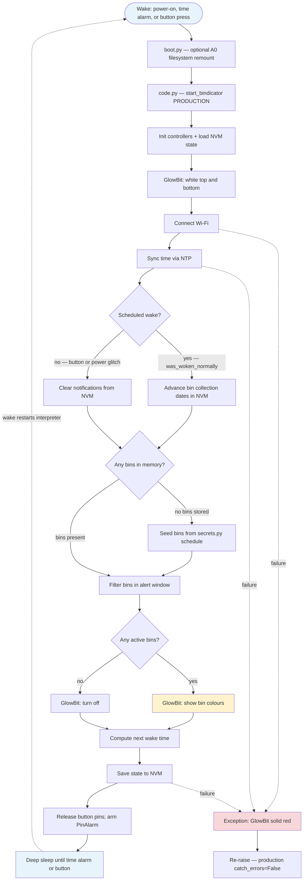

# PyBindicator — Agent Instructions

Firmware for a **Bindicator** — a 3D-printed wheelie-bin reminder that lights up the night before (and on) council waste collection days. Runs on CircuitPython on an Adafruit QT Py ESP32-S2.

Project by Dan Murphy and Simon Butler, based on an original idea by Darren Tarbard. Supporting design notes: [Bindicator 2022/2023 Notes](https://docs.google.com/document/d/1UN-GnOosNY1nSwaq9zUscx2jNm5FJPhstP8F_VgQk_4/edit).

## Hardware

| Item | Notes |
| --- | --- |
| **Adafruit QT Py ESP32-S2** | Main microcontroller. [Pinouts](https://learn.adafruit.com/adafruit-qt-py-esp32-s2/pinouts) · [CircuitPython setup](https://learn.adafruit.com/adafruit-qt-py-esp32-s2/circuitpython) |
| **GlowBit Stick 1×8** | 8-pixel NeoPixel strip (Core Electronics). Supply 3.3–5 V; logic 2.7 V–Vdd+0.7 V. [CE repo](https://github.com/CoreElectronics/CE-Glowbit-Stick-1x8) · bundled driver: `lib/glowbit.py` |
| **LED tactile button (TSD1265)** | White LED, 50 mA max. [Core Electronics](https://core-electronics.com.au/led-tactile-button-white.html) |
| **10 kΩ resistor** | Pull-up on button signal pin (prevents floating input) |
| **330 Ω resistor** | Button LED current limit (doc notes ~100 Ω may be better; verify for 3.3 V ESP32 output) |
| **Custom wheelie-bin STL files** | Print main body in **white** so light bleeds through; lid needs supports; use PVA/wood glue (not super glue) |
| **Custom button breakout PCB** | v1 and v2 designs referenced in project notes |
| **USB Type-C cable** | Programming and initial deploy |
| **Regulated 5 V power supply** | Recommended for long runtimes (5–6 hours alert window) |
| **4 screws** | Assembly (size TBD in notes) |

### Wiring (pin map)

| Signal | QT Py pin | Notes |
| --- | --- | --- |
| GlowBit data | **A1** | NeoPixel data line |
| GlowBit power | **5 V** | Prefer 5 V rail over 3.3 V (600 mA cap on 3.3 V); add series resistor if strip runs hot |
| GlowBit ground | **GND** | |
| Button LED | **A2** | Through current-limiting resistor |
| Button signal | **A3** | With 10 kΩ pull-up |
| Filesystem toggle (dev) | **A0** | Ground = USB writable; pulled up = software-only. See `boot.py` |

Firmware images and library bundles live in `deps/` (CircuitPython UF2, Adafruit bundle zip).

## General principles

- Keep changes minimal and focused. This is embedded CircuitPython — every import and byte counts.
- Use **snake_case** for modules, functions, methods, variables, and JSON keys. Use **CapWords** for classes only (`ButtonController`, `GlowBitController`).
- **Never commit real credentials.** `secrets.py` holds Wi-Fi and council URLs; treat it like `.env`. Prefer a `secrets.py.example` pattern if adding new secret keys.
- Do not create git commits unless the user explicitly asks.
- CircuitPython is a **subset of Python**. Confirm libraries exist on [CircuitPython docs](https://docs.circuitpython.org/) before adding dependencies.
- No compile step: copy `.py` files and `lib/` to the board’s USB drive, then reset.

## Documentation conventions

Firmware runs on flash-constrained hardware — keep documentation **minimal and purposeful**. Adafruit’s [CircuitPython Design Guide](https://docs.circuitpython.org/en/latest/docs/design_guide.html) targets published libraries (Sphinx `:param` docstrings for ReadTheDocs). This project uses a lighter subset.

| Use | When |
| --- | --- |
| **Module docstring** (top of file) | One to three lines: what the file does |
| **Function/method docstring** | Public entry points and non-obvious behaviour |
| **`#` inline comment** | Hardware quirks, CircuitPython constraints, workarounds |
| **Skip** | Obvious loops, getters, or code that reads clearly from names |

**Style:** plain triple-quoted strings (`""" ... """`). One-line docstrings for simple functions; a short paragraph only when behaviour needs context.

**Do not** add Sphinx `:param` blocks unless writing a reusable library module. **Do not** comment every line — docstrings cost flash/RAM and are stripped when using `.mpy` bytecode.

**Examples from this repo:**

```python
"""Production wake loop: Wi-Fi, schedule, lights, deep sleep."""

def start_program(catch_errors: bool):
    """Run one production cycle then deep-sleep until the next alarm."""

def build_pin_alarm(self):
    """Release pins and return a PinAlarm for wake-on-button."""
    # PinAlarm requires the pin be deinit'd first on ESP32-S2.
```

When adding comments, prefer *why* (alert window math, NVM migration, pin deinit) over *what* the next line does.

## Agent output

When your work is guided by a rule here, cite the section — e.g. *AGENTS.md → Hardware — GlowBit on 5 V*, or *AGENTS.md → General principles — no commits unless asked*.

## Repository layout

```
code.py                 # Entry point; selects PRODUCTION / DEBUG / SHOW mode
boot.py                 # A0 switch remounts filesystem for dev vs deploy
bindicator.py           # Main production loop (Wi-Fi, memory, lights, deep sleep)
config.py               # Non-secret settings (timezone, alert window, Wi-Fi retries)
secrets.py              # Wi-Fi SSID/password, bin schedule or council API URL (local only)
bin.py                  # Bin model + JSON → Bin conversion
monash.py               # Monash Council HTML-in-JSON waste API parser
helpers.py              # Time structs, alert window math, wake-reason helpers
*_controller.py         # One class per hardware concern (button, glowbit, wifi, time, memory)
debug_script.py         # Interactive hardware/network tests
demo_script.py          # Show mode: random colors on button wake
blink_patterns.py       # Legacy glow patterns — migrate into glow_bit_controller if extending
lib/                    # Vendored CircuitPython libraries (do not edit casually)
memory.txt              # Default NVM state template (first boot)
deps/                   # Firmware UF2 + Adafruit bundle (not deployed to board)
monash.txt              # Sample council HTML snippet for parser development
```

## Runtime modes (`code.py`)

| Mode constant | Behavior |
| --- | --- |
| `PRODUCTION` | `bindicator.start_program(False)` — full schedule, deep sleep, error re-raise |
| `DEBUG` | `debug_script.debug()` — blocks on button test loop, exercises Wi-Fi/Monash/memory |
| `SHOW` | `demo_script.demo()` — random top/bottom colors on button press |

Change the `start_bindicator(...)` argument at the bottom of `code.py` to switch modes.

## Production workflow (`bindicator.py`)

Each wake from deep sleep **restarts the CircuitPython interpreter**. `boot.py` runs first (A0 filesystem toggle), then `code.py` calls `bindicator.start_program(False)`. One production cycle looks like this:

### Production flow diagram



**Alert window** (default in `config.py`): from **12:00 the day before** collection through **12:00 on collection day**. A bin is “active” when the current time falls in that window relative to its next collection date.

**Wake sources during sleep:** `TimeAlarm` (next scheduled check) and optionally `PinAlarm` on the button (when `time.use_external_wake_up` is true).

**What production does not do:** live council API fetch (`monash.get_bin_data`) — schedules come from static `secrets['bins']`. DEBUG mode exercises the council parser.

### Steps (reference)

1. Boot controllers; show white on GlowBit top/bottom during startup.
2. Connect Wi-Fi (`WifiController`), sync time via NTP (`config['timezone_offset']`, default GMT+10).
3. Determine wake reason (`helpers.was_woken_normally` + `microcontroller.cpu.reset_reason`).
   - Normal scheduled wake → refresh bin dates in memory.
   - Button / power glitch → clear stale notifications.
4. If no bins in NVM → seed from `secrets['bins']` via `bin.convert_json_to_bin`.
5. Filter active bins by alert window (`TimeController.alert_begin` / `alert_end` vs collection date).
6. Display on GlowBit (`GlowBitController.show_notifications`) or turn off.
7. Compute next wake time, persist state to NVM, deep sleep until alarm or button.

Alert window defaults (in `config.py`): lights from **12:00** the day before collection through **12:00** on collection day (24 h clock).

## Controllers

| Module | Responsibility |
| --- | --- |
| `glow_bit_controller.py` | NeoPixel on A1; top (pixels 0–3) / bottom (4–7); bin colors RED/YELLOW/GREEN |
| `button_controller.py` | A2 LED, A3 input; `build_pin_alarm()` for wake-on-press (must `deinit` pins first) |
| `wifi_controller.py` | Connect, NTP, HTTP GET (`adafruit_requests`), optional JSON |
| `time_controller.py` | Light/deep sleep via `alarm.time.TimeAlarm` + optional `PinAlarm` |
| `memory_controller.py` | JSON state in NVM via `foamyguy_nvm_helper`; schema in `memory.txt` |

### Bin colors (Monash)

| Bin type | Color |
| --- | --- |
| Landfill Waste | Red |
| Recycling | Yellow |
| Food and Garden Waste | Green |

Other councils use different colors — adjust `monash.get_bin_color` or `secrets['bins']` colors accordingly.

## Configuration

### `config.py` (safe to commit)

- `timezone_offset` — hours from UTC for NTP
- `glowbit.brightness` — 0.0–1.0 NeoPixel brightness
- `button.debounce` — ms (debounce not fully implemented yet)
- `time.alert_begin` / `alert_end` — alert window strings (`"HH:MM"`)
- `time.use_external_wake_up` — include button `PinAlarm` in sleep
- `wifi.retries` / `timeout` — connection attempts and station timeout (ms)

### `secrets.py` (do not commit real values)

Expected keys:

```python
secrets = {
    'ssid': '...',
    'password': '...',
    'bin_data': {
        'bin_data_url': 'https://...monash.../wasteservices?geolocationid=...'
    },
    'bins': [
        {
            'label': 'Landfill Waste',
            'color': '(255, 0, 0)',       # stored as string; parsed in bin.py
            'start_date': 'YYYY/MM/DD/H/M/S/wday/yday/isdst',
            'frequency_in_days': 14
        },
        # ...
    ]
}
```

**Monash Council API:** JSON endpoint returns HTML in `responseContent`. Geolocation ID is address-specific — obtain from [My Area](https://www.monash.vic.gov.au/My-area) network tab. Parser: `monash.py` + vendored `lib/ElementTree.py`.

Production currently seeds bins from `secrets['bins']` (static schedule). Live council fetch is implemented in `monash.get_bin_data` for debug/experimentation.

NVM JSON uses snake_case keys (`last_wake_time`, `current_notifications`, etc.). `memory_controller.py` still accepts legacy PascalCase keys when loading old NVM state.

## Deploying to the board

1. Install [CircuitPython for QT Py ESP32-S2](https://circuitpython.org/board/adafruit_qtpy_esp32s2/) (see `deps/` for bundled UF2).
2. Board appears as USB mass storage (`CIRCUITPY`).
3. Copy project `.py` files, `lib/`, `memory.txt`, and local `secrets.py` to the drive root.
4. Press reset. `code.py` runs automatically.

Optional dev workflow: wire **A0** to ground to allow host writes while running; see [filesystem remount](https://learn.adafruit.com/cpu-temperature-logging-with-circuit-python?view=all#writing-to-the-filesystem).

Update CircuitPython and libraries periodically — bundled versions are in `deps/`.

## CircuitPython constraints

- No full CPython stdlib (no `xml.etree` — project ships minimal `ElementTree.py`).
- Cooperative multitasking via `asyncio` is possible but Wi-Fi/requests async support was immature when written; boot animations during Wi-Fi connect were deferred.
- Deep sleep **restarts** the interpreter; preserve state in NVM, not globals.
- `alarm.pin.PinAlarm` requires the pin be released (`deinit`) before sleep — see `ButtonController.build_pin_alarm`.
- Prefer [`alarm` wake reason API](https://learn.adafruit.com/deep-sleep-with-circuitpython/alarms-and-sleep#what-woke-me-up-3079890) over ad-hoc time comparisons where possible.

## Known issues and backlog

From code review and project notes — fix when touching related areas:

| Area | Issue |
| --- | --- |
| `bindicator.get_next_wake_time` | Loop always advances index to `len(notifications)` → likely index error |
| `memory_controller.save_to_mem` | Saves `next_wake_time` from `last_wake_time` (copy-paste bug) |
| `helpers.was_woken_normally` | Compares reset reason strings incorrectly; button wake detection unreliable |
| `bin.convert_json_to_bin` | `color` in secrets is a string; may need parsing to tuple |
| `Bin.set_next_collection_date` | Compares `struct_time` to int; invalid date math |
| `button_controller.read_button_state` | Debounce not implemented (see Adafruit `debouncer` library) |
| Hardware | GlowBit heat on 5 V over long periods — consider resistor on 5 V line or lower brightness |
| 3-bin display | `show_notifications` raises for three simultaneous bins |

Low-priority / nice-to-have from notes: CPU temperature probe, email error reports, async startup animation, solid-print lid STL (+2.5 mm body height).

## When changing behavior

1. Decide mode: production schedule vs council API vs static `secrets['bins']`.
2. Update `config.py` and/or `secrets.py` (never commit real secrets).
3. If NVM schema changes, update `memory.txt` defaults and handle migration in `MemoryController`.
4. Test on device in `DEBUG` before `PRODUCTION` — debug mode blocks on button test unless that section is commented out.
5. Copy to `CIRCUITPY` and reset; use serial REPL (Mu or equivalent) for `print` output.

## Reference links

- [QT Py ESP32-S2 guide](https://learn.adafruit.com/adafruit-qt-py-esp32-s2)
- [Deep sleep & alarms](https://learn.adafruit.com/deep-sleep-with-circuitpython/alarms-and-sleep)
- [CircuitPython libraries bundle](https://circuitpython.org/libraries)
- [Cooperative multitasking (asyncio)](https://learn.adafruit.com/cooperative-multitasking-in-circuitpython-with-asyncio/concurrent-tasks)
- [Push button wiring (pull-up vs pull-down)](https://create.arduino.cc/projecthub/mdraber/using-pushbuttons-with-arduino-pullup-vs-pulldown-resistors-f33d33)
